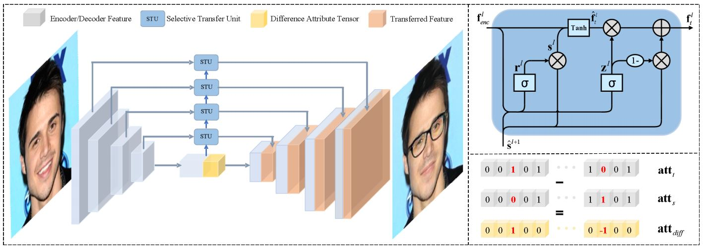
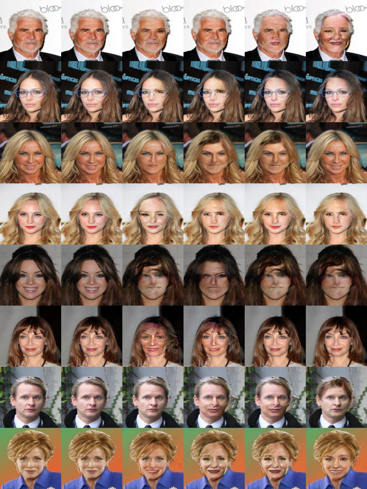

# STGAN: A Unified Selective Transfer Network for Arbitrary Image Attribute Editing

This repository implements the paper ["STGAN: A Unified Selective Transfer Network for Arbitrary Image Attribute Editing"](https://arxiv.org/abs/1904.09709) published in CVPR2019.

## Requirements
* python3.6+
* pytorch 1.6.0
* others.

## Usage
training a model
```bash
python3 main.py --config config.yml
```

testing a model
```bash
Not implmented yet
```

## Architecture

## Results


## Comments
 In this implementation, image size is 256, attributes in the example image are randomly shuffled then some translated images are the same.
## Reference
1. spectral normalization : https://github.com/christiancosgrove/pytorch-spectral-normalization-gan/blob/master/spectral_normalization.py
2. unet : https://github.com/milesial/Pytorch-UNet
3. dataset : https://www.dropbox.com/sh/8oqt9vytwxb3s4r/AAB06FXaQRUNtjW9ntaoPGvCa?dl=0
